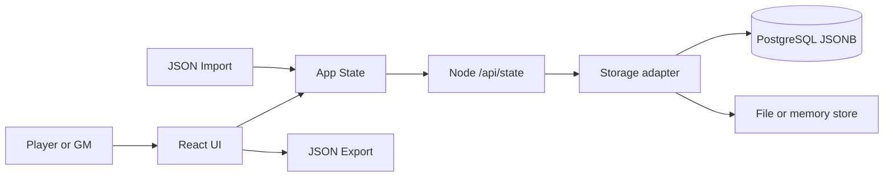

# Architecture

## System overview

Evolution RPG System Ledger is a React application served by a small Node API. It turns the RPG rule documents into a guided character creator, character sheet, and tier-path tracker backed by shared server-side persistence.

## Major components

- `src/App.tsx`: Main UI, roster, wizard, sheet, item/skill editors, and path visualization.
- `src/types.ts`: Character, track, stat, skill, item, player, and app-state types.
- `src/data.ts`: RPG constants, default stat category/primary/secondary stat definitions, default tier/character type/rarity definitions, default Compendium templates, default character creation, and rule helpers.
- `src/storage.ts`: Browser API client, state sanitization, empty shared-state creation, and JSON import/export.
- `src/styles.css`: Dark System-window visual design.
- `server/index.js`: Combined static file server and JSON API.
- `server/storage.js`: Persistence adapter factory for PostgreSQL, file, and in-memory stores.

## Data flow

1. App loads state from `GET /api/state`.
2. Users create or edit players and characters.
3. React state updates immediately.
4. A state effect saves every change to `PUT /api/state`.
5. Export/import provides manual backup and transfer.

## Control flow

- The left roster selects the active character.
- The top tabs switch between sheet, creation/editing, and System path views.
- The top tabs switch between sheet, creation/editing, System path, and Compendium views.
- The creation wizard normalizes race/class/job availability based on character type and assigns templates via drag/drop.
- Compendium radar charts capture stat-growth ratios; formulas convert those ratios into stat points during level-up.
- The Compendium also owns tier definitions, character type multipliers, stat categories, primary stat metadata, secondary stat formulas, rarity, affinity, skill, and item templates. Tier definitions are stored in shared state with number, title, details, max level, race/class/job/item multipliers, and static tier bonus. Character type definitions are stored in shared state with kind, label, and multiplier. Primary stat definitions store label/category/aggressive-or-defensive role/order, while secondary stat definitions store short name, long name, description, and formula inputs. Rarity definitions are stored in shared state with name, multiplier, and color; item templates calculate equipment bonuses from tier, rarity, and radar ratios and can reference skill templates for item skills.

## External dependencies

- React and React DOM for UI.
- Vite for local development and production bundling.
- Node's built-in HTTP server for the runtime API.
- `pg` for PostgreSQL persistence when `DATABASE_DRIVER=postgres`.

## Configuration model

Runtime persistence is controlled by `.env.example` variables. `DATABASE_DRIVER=postgres` is intended for production, `file` is useful for local shared development, and `memory` is intended for tests.

## Security boundaries

- Data is stored server-side so all users connected to the same deployment see the same ledger.
- Export files may contain character notes and should be shared intentionally.
- Database credentials belong in environment variables and must not be committed.

## Persistence/storage model

The API stores one serialized `AppState` document under `APP_STATE_KEY` with a numeric revision for stale-write detection. PostgreSQL uses the `app_state.state` JSONB column plus `revision`; file and memory adapters implement the same `getState`/`saveState` contract for local and test use. Empty databases return an empty table ledger with default compendium definitions and no sample characters.

## Error handling strategy

- Missing shared state falls back to an empty ledger with default compendium definitions.
- API load/save failures are shown in the roster panel; stale saves return `409 Conflict` and require a reload before retrying.
- Invalid imports show a user-facing error.

## Background jobs or workers

None.

## API boundaries

The browser uses `GET /api/state` and `PUT /api/state` for shared persistence. `GET` returns an `ETag` revision; `PUT` sends that revision through `If-Match` so stale writes can be rejected. Static assets are served by the same Node process in the production container.

## Known tradeoffs

- Whole-ledger JSONB persistence is simple and database-backed, but concurrent edits require a reload/retry instead of real-time collaborative merges.
- Character rules are editable/flexible rather than deeply validated, because the rule docs are intentionally loose.

## Future extension points

- Authentication and per-user permissions.
- Shared campaign/party ledgers.
- Automated tier-up suggestions.
- Rule-pack JSON generated from the Markdown specs.
- Test suite for calculations and progression gating.
